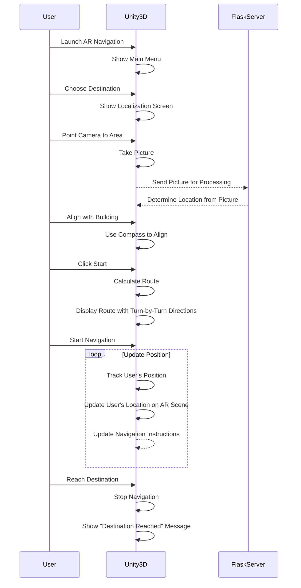

# KOE Wayfinder App

> Final Year Project (Mechatronics | 2022/2023)

## About project

Augmented Reality (AR) **turn-by-turn navigation** in Kuliyyah of Engineering building.

## Getting started

### Prerequisites

- [Unity 2021.3.x](https://unity3d.com/get-unity/download/archive)
- [Android Studio](https://developer.android.com/studio) (maybe optional idk)

### Using AR Server

To run the localization inference, AR Server need to be running. Learn more on how to setup AR Server here https://github.com/KOE-Wayfind/AR-server.

### Build and run

1. Create keystore for signing the app (if you don't have it yet). Learn more [here](https://docs.unity3d.com/Manual/android-keystore-manager.html)
2. Go to Edit > Project Settings > Player > Android > Publishing Settings and fill in the keystore information.
3. Go to File > Build Settings and select Android as the platform.
4. Connect Android device to the computer. See [development device](#development-device).
5. Click Build and Run.

## Development device

The application is best run on a real physical device, because you can interact with it physically (ie holding, walking, moving around with the camera)

There is a package called [AR Foundation Remote 2.0](https://assetstore.unity.com/packages/tools/utilities/ar-foundation-remote-2-0-201106) that allows debugging AR application
right from the Unity editor. 

### Android Requirements

- Android 7.0 (API Level 24) or later

List of the supported devices by ARCore: https://developers.google.com/ar/devices

I'm using [Redmi Note 11](https://www.gsmarena.com/xiaomi_redmi_note_11-11336.php) (Android 12) for development.

## Overall working principle

Sequence diagram below shows the overall working principles of the application.

## Releases

Download the app from [releases](https://github.com/KOE-Wayfind/KOE-Wayfinder-App/releases) page

## References

- [ARCore](https://developers.google.com/ar)
- [Unity ARFoundation](https://developers.google.com/ar/develop/unity-arf/features)
- [ARFoundation Indoor-Navigation Tutorial](https://youtube.com/playlist?list=PLOIYTfRd0Ho7iOI_cnUZxXK6KiCFGhU1s)
